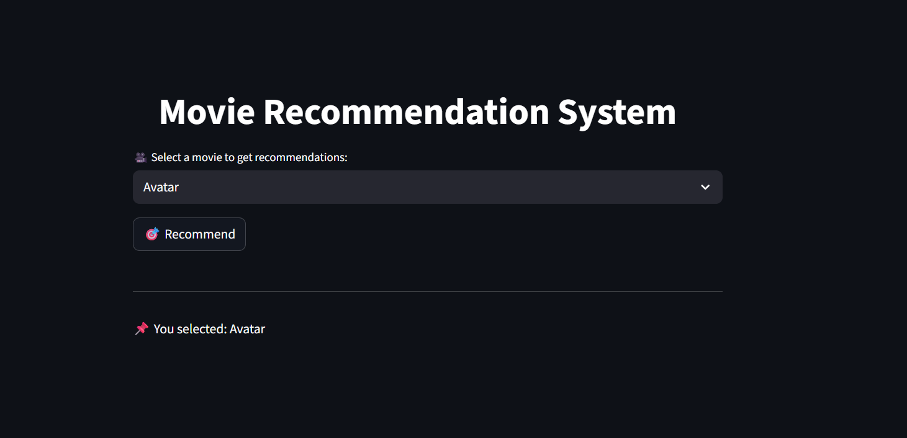
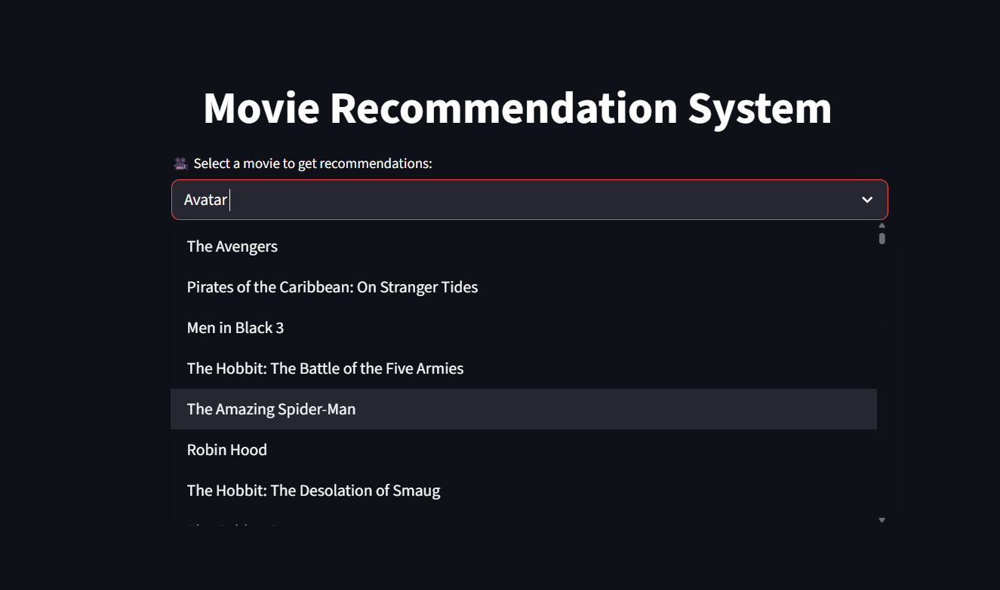

# 🎬 Movie Recommendation System

An intelligent movie recommender system built with **Python**, **Machine Learning**, and **Streamlit**, that suggests similar movies based on user selection.



## 🚀 Features

- 🎥 Select your favorite movie from the dropdown
- 🤖 Recommends 5 similar movies using a similarity matrix
- 🖼️ Displays movie posters for each recommendation
- 🧠 Built using cosine similarity on movie vectors
- 🌐 Styled and deployed using Streamlit

## 🧠 How it Works

- Uses a preprocessed dataset of movies with genre, overview, and keywords
- Generates **TF-IDF vectors** or **CountVectorizer vectors**
- Computes **cosine similarity** between movies
- Shows top 5 most similar titles

  
## 📸 UI Screenshots

| Dropdown UI                              | Recommendations Output                      |
|------------------------------------------|---------------------------------------------|
|   | |


## 📁 Project Structure

```bash
movie-recommender-system/
│
├── app.py                  # Main Streamlit app
├── data/                   # Movie datasets
├── similarity.pkl          # Precomputed similarity matrix
├── README.md               # Project documentation
├── requirements.txt        # Python dependencies
└── images/                 # Screenshots for documentation


## 🛠️ Technologies Used

- Python
- Pandas, NumPy, Scikit-learn
- Streamlit
- TMDB API for posters
- Pickle (for model persistence)


## 📦 Installation

```bash
git clone https://github.com/Prem3903/movie-recommendation-system.git
cd movie-recommendation-system
pip install -r requirements.txt
streamlit run app.py
